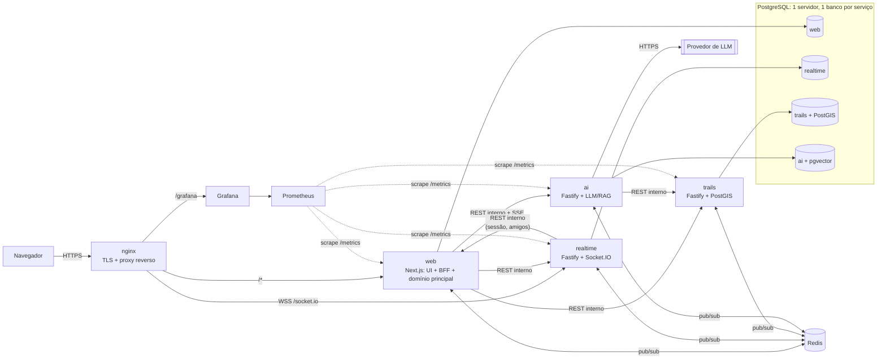
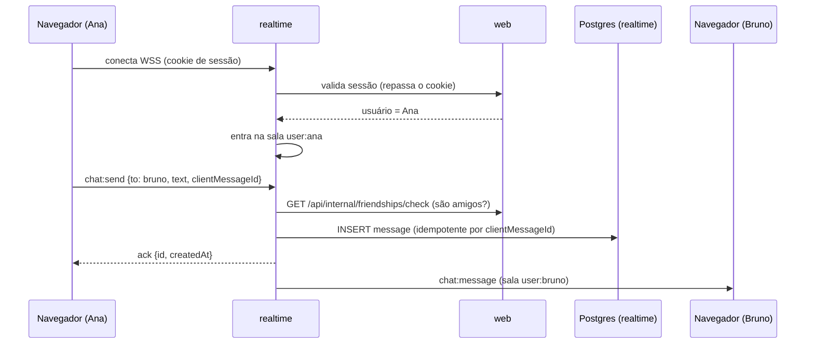
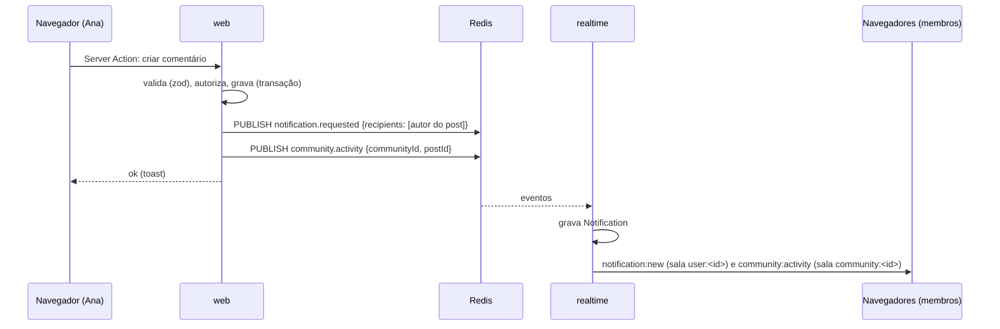
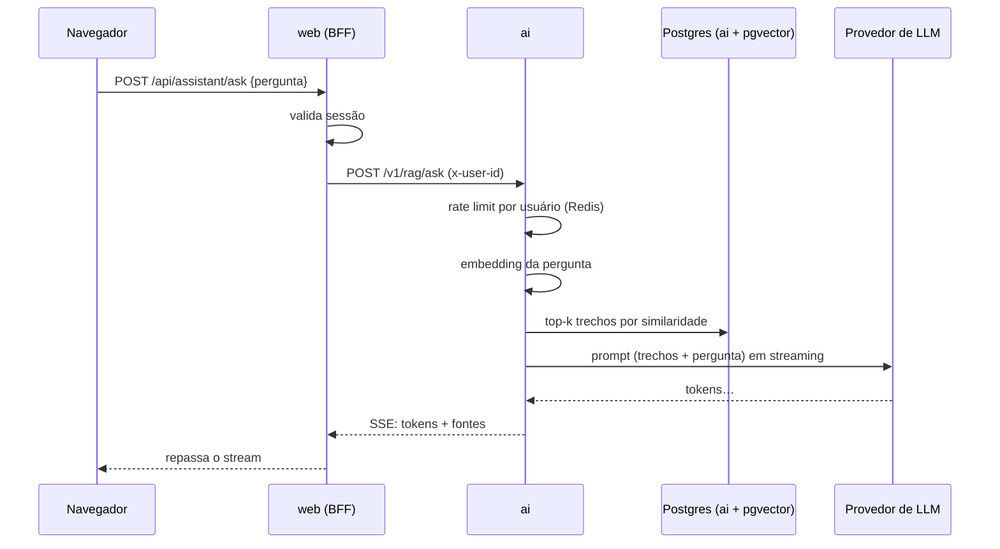
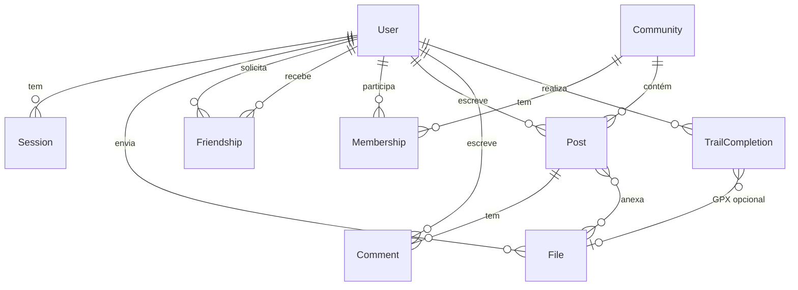

# Arquitetura

> Última atualização: 2026-10-01 — arquitetura proposta (aceitar ADRs 0001–0009 no kickoff).
> Dono: Tech Lead. Mudanças aqui exigem PR revisada pelo Tech Lead e, se forem estruturais, uma ADR.

Este é o documento que **amarra todas as frentes**. Ele define o que é comum a todos: serviços, como conversam, onde ficam os dados e as convenções. O detalhe de cada parte fica no README da frente correspondente.

## 1. Visão geral



Resumo em uma frase: **o navegador fala só com o nginx; o `web` (Next.js) é a porta de entrada HTTP e o dono do domínio principal; três serviços satélites cuidam de tempo real, trilhas e IA; os serviços conversam por REST interno (síncrono) e por eventos no Redis (assíncrono).**

> 💡 **Conceito: microsserviços pragmáticos.** Microsserviços dividem o backend em processos independentes, cada um com uma responsabilidade, seu próprio banco e uma interface bem definida. O custo é complexidade: rede, consistência entre bancos, deploy. Por isso dividimos **só onde há motivo real**: o WebSocket precisa de um processo de longa duração (o Next.js não oferece isso nativamente), o catálogo de trilhas tem processamento geoespacial próprio, e a IA tem dependências e custos próprios. O resto fica no `web`. Ver [ADR-0001](adr/0001-arquitetura-servicos.md).

## 2. Serviços

| Serviço | Responsabilidade única | Tecnologia | Banco | Frente | Porta interna |
|---|---|---|---|---|---|
| `nginx` | Entrada única: TLS, roteamento, headers de segurança, bloqueio de rotas internas | nginx | — | F1 | 443 (host: `8443`) |
| `web` | Interface + BFF + domínio principal: identidade, perfis, amigos, comunidades, arquivos, trilhas realizadas | Next.js (App Router), Better Auth, Prisma | `web` | F2, F3, F4 | 3000 |
| `realtime` | Comunicação em tempo real com usuários: conexões WebSocket, presença, chat, notificações | Fastify + Socket.IO, Prisma | `realtime` | F3 | 4001 |
| `trails` | Catálogo de trilhas: ingestão do OSM, busca geoespacial, detalhe e elevação | Fastify, Prisma + SQL PostGIS | `trails` | F4 | 4002 |
| `ai` | Assistente: geração de texto com LLM e RAG sobre trilhas | Fastify, SDK do provedor, Prisma + pgvector | `ai` | F5 | 4003 |
| `postgres` | Banco relacional (um servidor, quatro bancos) | PostgreSQL + PostGIS + pgvector | — | F1 | 5432 |
| `redis` | Pub/sub de eventos e contadores de rate limit | Redis | — | F1 | 6379 |
| observabilidade | Métricas, dashboards, alertas | Prometheus, Grafana, Alertmanager, exporters | — | F1 | — |
| `backup` | Backups agendados e restauração | Container com `pg_dump` + cron | — | F1 | — |

**Só o nginx publica porta no host.** Todos os outros ficam na rede interna do Docker. Isso é o que garante "HTTPS em todo lugar" do subject.

## 3. Comunicação

### 3.1 Navegador → sistema

- **HTTP (páginas, formulários, APIs):** navegador → nginx → `web`. O `web` usa Server Components para ler dados e Server Actions ou Route Handlers para escrever.
- **WebSocket:** navegador → nginx (`/socket.io/`) → `realtime`. O cookie de sessão vai junto no handshake (mesma origem).
- O navegador **nunca** chama `trails` ou `ai` diretamente. O `web` faz isso no servidor (padrão **BFF**, Backend for Frontend).

> 💡 **Conceito: BFF.** O "backend para o frontend" é a camada que o navegador enxerga. Ele autentica o usuário uma vez, chama os serviços internos e devolve exatamente o que a página precisa. Vantagens: um único ponto de autenticação, nenhum problema de CORS e serviços internos nunca expostos.

### 3.2 Serviço → serviço (REST interno, síncrono)

- URLs pela rede do Docker: `http://trails:4002`, `http://ai:4003`, `http://realtime:4001`, `http://web:3000`.
- Toda chamada interna envia `x-internal-token` (segredo compartilhado do `.env`). O serviço recusa chamadas sem ele.
- O contexto do usuário vai em `x-user-id`, preenchido pelo `web` **depois** de validar a sessão. Serviços internos confiam nesse header apenas se o token interno for válido.
- `x-request-id` é propagado em toda a cadeia (o nginx gera) para correlacionar logs.
- Timeout padrão de 5 s; streams de IA, 60 s. Se o serviço chamado estiver fora, o `web` mostra um estado degradado e não quebra a página.
- No `web`, as rotas internas ficam em `/api/internal/*` e o **nginx bloqueia esse caminho para acesso externo**.

Contratos (endpoints, payloads): [contracts/README.md](contracts/README.md) e `packages/contracts`.

### 3.3 Eventos (Redis pub/sub, assíncrono)

- Um produtor publica um evento; quem tiver interesse assina. O produtor não sabe quem consome. É isso que deixa os serviços **desacoplados**.
- Envelope padrão (schema zod em `packages/contracts`):
  ```json
  { "id": "uuid", "type": "notification.requested", "version": 1,
    "occurredAt": "2026-10-01T12:00:00Z", "producer": "web",
    "actorId": "user-uuid", "payload": { } }
  ```
- Canais por domínio: `events:notifications`, `events:community`, `events:social`, `events:trails`.
- **Entrega "no máximo uma vez":** se ninguém está assinando no momento (serviço reiniciando), o evento se perde. Aceitamos isso porque os dados importantes estão no banco e o cliente ressincroniza ao reconectar. Se isso virar problema, o caminho de evolução é Redis Streams ou BullMQ ([ADR-0005](adr/0005-comunicacao.md)).
- Publicar sem assinante é inofensivo. Por isso, **produtores podem publicar desde o primeiro dia**, mesmo antes de o consumidor existir.

> 💡 **Conceito: síncrono × assíncrono.** REST é síncrono: quem chama espera a resposta e depende do outro estar no ar. Eventos são assíncronos: quem publica segue a vida. Regra prática: use REST quando **precisa da resposta agora** (ex.: buscar trilhas para renderizar a página) e evento quando está **avisando que algo aconteceu** (ex.: "comentário criado, notifique quem interessa").

### 3.4 Três fluxos de exemplo

**Mensagem de chat**



**Comentário em comunidade → notificação + feed ao vivo**



**Pergunta ao assistente (streaming)**



## 4. Autenticação e autorização

- **Better Auth** no `web`: e-mail e senha (hash com scrypt e salt, feito pela biblioteca), sessão guardada no banco e enviada em cookie `HttpOnly`, `Secure`, `SameSite=Lax`. Ver [ADR-0004](adr/0004-autenticacao.md).
- Helpers do `web` (F2 entrega no Sprint 0): `getSession()` (pode retornar nulo) e `requireUser()` (redireciona ou retorna 401).
- **realtime:** no handshake, repassa o cookie para o endpoint de sessão do `web` e guarda o `userId` no socket. Socket sem sessão válida é recusado. O cliente **só tenta conectar depois do login**, para não sujar o console.
- **Serviços internos:** confiam no `x-user-id` vindo do `web` (com token interno válido). Cada serviço **autoriza** as próprias operações (ex.: o `realtime` verifica amizade antes de aceitar uma mensagem).
- **Autorização no `web`:** checar sempre no servidor (nunca só esconder botão). Papéis por comunidade: `owner`, `moderator`, `member` ([PRODUCT.md](PRODUCT.md#5-regras-de-produto)).

> 💡 **Conceito: autenticação × autorização.** Autenticar é provar **quem** você é (login). Autorizar é decidir **o que** você pode fazer (ex.: só membros leem posts de comunidade privada). Bugs de autorização são os mais comuns em projetos web: toda query que retorna dados de outra pessoa precisa de um filtro de permissão.

## 5. Dados

### 5.1 Um servidor, um banco por serviço

| Banco | Dono | Frentes | Entidades principais |
|---|---|---|---|
| `web` | `web` | F2, F3, F4 | User, Session, Account (Better Auth), File, Friendship, Community, Membership, Post, Comment, TrailCompletion |
| `realtime` | `realtime` | F3 | Conversation, Message, Notification |
| `trails` | `trails` | F4 | Trail, Poi, IngestionRun |
| `ai` | `ai` | F5 | Document, Chunk (embedding), AiRequest |

Regras:
1. **Nenhum serviço lê ou escreve no banco de outro.** Cada serviço tem um usuário de banco com permissão só no próprio banco.
2. **Referências entre serviços são por ID, sem chave estrangeira.** Exemplo: `TrailCompletion.trailId` aponta para uma trilha do serviço `trails`.
3. **Snapshot quando precisar agregar:** `TrailCompletion` guarda `lengthM` e `elevationGainM` copiados da trilha no momento do registro. Assim o ranking é uma query local, sem chamar outro serviço.
4. IDs `uuid`, timestamps em UTC (`createdAt`, `updatedAt`), datas exibidas em `America/Sao_Paulo`.
5. **Integridade e concorrência:** use constraints `UNIQUE` (ex.: par de amizade), transações para operações múltiplas e chaves de idempotência (ex.: `clientMessageId` no chat). É isso que atende ao requisito "sem race conditions" do subject.

> 💡 **Conceito: database-per-service.** Se dois serviços compartilham tabelas, uma mudança de schema quebra os dois: eles ficam acoplados. Com um banco por serviço, cada um evolui o próprio schema. O preço é que "joins" entre serviços viram chamadas de API ou cópias (snapshots). Usamos um único **servidor** Postgres para economizar memória; o isolamento é por **banco** e por **usuário**.

### 5.2 Modelo principal (banco `web`), esboço



O schema detalhado vive nos arquivos Prisma (fonte da verdade). Este diagrama é atualizado quando muda uma **relação**, não a cada campo novo. O README final terá o diagrama completo, gerado a partir do schema.

### 5.3 Prisma e migrations

- Um schema Prisma por serviço. No `web`, **um arquivo `.prisma` por domínio** (`auth.prisma`, `social.prisma`, `communities.prisma`, `files.prisma`, `trails.prisma`), usando o suporte a múltiplos arquivos do Prisma. Isso reduz conflitos entre frentes.
- **Uma migration por PR.** Se a `main` ganhou outra migration enquanto você trabalhava: faça rebase, apague a sua migration local e gere de novo. Ver [CONTRIBUTING.md](../CONTRIBUTING.md#migrations-do-prisma).
- **PostGIS e pgvector:** o Prisma não tem tipos nativos para `geometry` e `vector`. Use `Unsupported("geometry(MultiLineString, 4326)")` no schema e `$queryRaw` (com template tag, que é seguro contra SQL injection) nas consultas espaciais e vetoriais. **Nunca** use `$queryRawUnsafe` com dado do usuário.
- Migrations rodam automaticamente no start de cada container (`prisma migrate deploy`). O seed roda se o banco estiver vazio.

## 6. Estrutura do repositório

```
.
├── AGENTS.md  CLAUDE.md  README.md  CONTRIBUTING.md
├── Makefile                  # `make` sobe tudo (comando único exigido)
├── compose.yaml
├── .env.example
├── apps/
│   └── web/                  # Next.js: UI + BFF + domínio principal
│       ├── app/              # rotas do App Router, agrupadas por frente:
│       │                     #   (trilhas)/ (social)/ (comunidades)/ (conta)/ (ia)/
│       ├── components/ui/    # componentes base (shadcn/ui), dono: Tech Lead
│       ├── lib/              # auth, db, clientes dos serviços, publishEvent()
│       └── prisma/schema/    # um .prisma por domínio
├── services/
│   ├── realtime/             # Fastify + Socket.IO
│   ├── trails/               # Fastify + PostGIS; scripts/ingest, seed/
│   └── ai/                   # Fastify + LLM + RAG; corpus/
├── packages/
│   ├── contracts/            # schemas zod: eventos, DTOs internos, eventos de socket
│   ├── service-kit/          # base Fastify: logger, erros, /health, /ready, /metrics, auth interna
│   └── config/               # tsconfig e eslint compartilhados
├── infra/
│   ├── nginx/  postgres/  prometheus/  alertmanager/  grafana/  backup/
├── e2e/                      # Playwright: smoke tests + verificação de console limpo
└── docs/
```

Monorepo com **pnpm workspaces**, TypeScript em tudo ([ADR-0002](adr/0002-monorepo-typescript.md)).

## 7. Convenções transversais

| Tema | Convenção |
|---|---|
| Validação | zod. O mesmo schema valida o formulário (react-hook-form) e o backend. Schemas compartilhados entre serviços ficam em `packages/contracts`. |
| Erros HTTP | Status correto + corpo `{ "error": { "code": "TRAIL_NOT_FOUND", "message": "…", "details": … } }`. Nada de stack trace na resposta. |
| Paginação | `?page=1&pageSize=20` → `{ items, page, pageSize, total }`. `pageSize` máximo de 50. |
| Logs | JSON (pino), com `service`, `requestId`, `userId` quando houver. Sem senhas, tokens ou conteúdo de mensagens. |
| Métricas | Todo serviço expõe `/metrics` (formato Prometheus) via `service-kit`; o `web` expõe `/api/metrics`. Métricas RED (rate, errors, duration) por rota + métricas de negócio. |
| Saúde | `/health` (o processo está vivo?) e `/ready` (consegue atender? banco e Redis ok?). |
| Configuração | Variáveis de ambiente, validadas com zod no boot (o serviço não sobe se faltar variável). |
| Datas | ISO 8601 em UTC na API; formatação local só na UI. |
| Nomes | Código em inglês; textos de UI em pt-BR. Eventos `dominio.entidade.acao` (ex.: `community.post.created`). |
| Feature flags | Variáveis `FEATURE_*` para esconder funcionalidade incompleta da navegação. A `main` sempre pode ser demonstrada. |

## 8. Frontend

- **App Router** do Next.js: Server Components por padrão; Client Components (`"use client"`) apenas onde há interatividade (mapa, chat, upload, formulários).
- **Estilo:** Tailwind CSS + shadcn/ui (componentes acessíveis baseados em Radix). Ver [ADR-0008](adr/0008-frontend-mapas.md).
- **Formulários:** react-hook-form + zod.
- **Mapa:** Leaflet via react-leaflet, carregado só no cliente (`dynamic(..., { ssr: false })`), porque o Leaflet acessa `window`. Atribuição do OSM sempre visível.
- **Gráficos:** Recharts (perfil de elevação).
- **Estado:** comece sem biblioteca de estado global. Leitura com Server Components; escrita com Server Actions + `router.refresh()`; tempo real com estado local alimentado pelo socket. Adote TanStack Query apenas se a complexidade justificar (decisão da frente, registrada).
- **Busca:** filtros, ordenação e página ficam **na URL** (`searchParams`). A busca vira compartilhável e funciona com renderização no servidor.
- **Acessibilidade e responsividade** (obrigatórias): HTML semântico, `alt` em imagens, foco visível, navegação por teclado, lista de trilhas como alternativa ao mapa, layout mobile-first.

> 💡 **Conceito: Server × Client Components.** Server Components rodam no servidor, acessam dados diretamente e não mandam JavaScript para o navegador. Client Components rodam no navegador e podem usar estado, efeitos e eventos. Erros de **hydration** (texto diferente entre servidor e cliente, como datas ou `Math.random`) aparecem no console e reprovam o projeto.

## 9. Infraestrutura e execução

- **Comando único:** `make` → verifica o `.env` (cria a partir do `.env.example` com segredos aleatórios, se faltar) → `docker compose up --build -d`.
- **Ordem de subida:** `depends_on` com `condition: service_healthy`. O Postgres sobe primeiro; depois cada serviço roda migrations e fica pronto; por último, o nginx.
- **TLS:** o nginx gera um certificado autoassinado na primeira subida, se não houver um. O navegador mostra aviso, e isso é esperado. A porta 80 redireciona para a 443.
- **Redes:** `public` (só nginx) e `internal` (todo o resto).
- **Volumes:** `pgdata`, `uploads`, `backups`, `grafana-data`, `prometheus-data`.
- **Imagens:** Dockerfiles multi-stage. O Next.js usa `output: "standalone"`.
- **Recursos:** são cerca de 15 containers. Defina limites de memória e meça o consumo cedo (máquinas da 42 e WSL2). A observabilidade pode ficar em um profile do compose que é desligado no dia a dia.
- **Desenvolvimento:** infraestrutura (Postgres, Redis) no Docker e os apps com hot reload no host (`pnpm dev`). Detalhes no guia de setup (F1, Sprint 0).

## 10. Observabilidade, saúde e backups (resumo)

Detalhes em [frentes/plataforma/README.md](frentes/plataforma/README.md).

- **Prometheus** coleta `/metrics` de todos os serviços e dos exporters (node, cAdvisor, Postgres, Redis, nginx).
- **Grafana** com dashboards provisionados por arquivo (versionados no repo), servido em `/grafana/` via HTTPS, com login obrigatório.
- **Alertas:** regras no Prometheus (serviço fora, taxa de erro, latência, backup atrasado) → Alertmanager → canal `#alertas` no Discord.
- **Status page** em `/status`: consulta o `/ready` de cada serviço e o horário do último backup.
- **Backups** automáticos (`pg_dump` de cada banco + volume de uploads) com retenção, `make restore` e runbook de recuperação de desastre testado.

## 11. Segurança (checklist transversal)

- [ ] Só o nginx exposto; HTTP redireciona para HTTPS; HSTS e headers de segurança no nginx.
- [ ] `/api/internal/*` e `/api/metrics` bloqueados no nginx; serviços internos exigem `x-internal-token`.
- [ ] Senhas com hash (Better Auth); rate limit no login.
- [ ] Validação zod no front **e** no back para toda entrada.
- [ ] Uploads: tipo verificado pelo conteúdo (magic bytes), tamanho limitado, nome aleatório no disco, metadados EXIF removidos das imagens, download só com permissão.
- [ ] Queries com dados do usuário apenas via Prisma ou `$queryRaw` com template tag.
- [ ] Conteúdo de usuário renderizado sem `dangerouslySetInnerHTML`; markdown da IA sanitizado.
- [ ] Segredos só no `.env`; `.env.example` sem valores reais.
- [ ] Grafana com senha forte e sem acesso anônimo; Prometheus e Alertmanager não expostos.

## 12. Decisões e questões em aberto

| ADR | Decisão | Status |
|---|---|---|
| [0001](adr/0001-arquitetura-servicos.md) | Next.js como web/BFF + 3 serviços satélites | Proposta |
| [0002](adr/0002-monorepo-typescript.md) | Monorepo pnpm, TypeScript em tudo, Fastify nos serviços | Proposta |
| [0003](adr/0003-banco-de-dados.md) | Postgres: 1 servidor, 1 banco por serviço; Prisma; PostGIS e pgvector | Proposta |
| [0004](adr/0004-autenticacao.md) | Better Auth com sessão em cookie | Proposta |
| [0005](adr/0005-comunicacao.md) | REST interno + Redis pub/sub + Socket.IO | Proposta |
| [0006](adr/0006-dados-de-trilhas-osm.md) | Ingestão offline do OSM, seed versionado, elevação via Open-Meteo | Proposta |
| [0007](adr/0007-provedor-llm-embeddings.md) | Provedor de LLM e embeddings | **Pendente: decidir no kickoff** |
| [0008](adr/0008-frontend-mapas.md) | Tailwind + shadcn/ui, Leaflet, Recharts | Proposta |
| [0009](adr/0009-armazenamento-arquivos.md) | Arquivos em volume local com acesso autenticado | Proposta |

Questões em aberto (resolver com ADR ou nos planos das frentes):
- Histórico do chat e lista de notificações: o `web` repassa para o `realtime` via REST (proposta) ou o cliente busca pelo socket? (F3)
- Formato do perfil de elevação: amostras a cada 25 ou 50 m? (F4)
- Status page: mostrar histórico de uptime via API do Prometheus? (F1, opcional)
