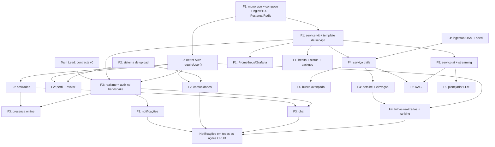

# Roadmap

> Última atualização: 2026-10-01 — proposta de 8 semanas (ajustar no kickoff).
> Dono: PM. O status atual dos marcos está em [STATUS.md](STATUS.md#marcos).

## 1. Estratégia

1. **Esqueleto andando primeiro (walking skeleton).** Na semana 1, todos os serviços sobem, conversam entre si e passam por HTTPS, mesmo que façam quase nada. Problemas de integração (Docker, nginx, WebSocket, auth entre serviços) aparecem cedo, quando são baratos.
2. **Contratos antes do código.** Eventos e endpoints internos são definidos em `packages/contracts` antes de quem consome precisar deles. Cada frente programa contra o contrato, não contra a implementação da outra.
3. **Ninguém espera ninguém.** Toda dependência tem um substituto temporário (seção 5).
4. **Integração contínua.** PRs pequenos, merge na `main` pelo menos a cada 2 dias, demo toda sexta.
5. **Núcleo antes de margem; margem antes de reserva** ([MODULES.md](MODULES.md#1-pontuação)).
6. **Feature freeze no M2.** Depois disso, só completar, integrar, corrigir e ensaiar.

Se o prazo for menor, comprima juntando as fases 2 e 3 (6 semanas) e mantendo o M0 intocado.

## 2. Fases e marcos

Datas propostas (semana 1 começa na segunda, 2026-10-05).

### Fase 0: Fundação · Semana 1 (05–11/10) → **M0 Esqueleto andando**

| Quem | Entregas |
|---|---|
| Todos | Kickoff (decisões pendentes de [STATUS.md](STATUS.md#decisões-pendentes-kickoff)); ambiente de dev funcionando; primeiro commit de cada um |
| Tech Lead | `packages/contracts` v0 (envelope de evento, `notification.requested`, erros padrão); layout base (header, footer com Privacidade e Termos, navegação) com Tailwind e shadcn/ui; revisão das ADRs |
| F1 Plataforma | Monorepo pnpm; `compose.yaml` com Postgres (PostGIS + pgvector), Redis e nginx com TLS; `service-kit` + template de serviço Fastify; Makefile; CI (lint, typecheck, testes) |
| F2 Identidade | Better Auth (cadastro, login, logout); `getSession()`/`requireUser()`; seed com usuários de teste |
| F3 Social | `realtime` a partir do template; auth no handshake; sala `user:<id>`; prova de conceito de presença |
| F4 Trilhas | **Spike OSM** (2–3 dias): script de ingestão v0 → seed com 20–50 trilhas; `trails` com `GET /v1/trails` |
| F5 IA | ADR-0007 decidida; `ai` a partir do template; provedor `mock` + provedor real; streaming de "olá" até o navegador via `web` |

**Critério de saída M0:** em uma máquina limpa, `make` → `https://localhost:8443` abre a Home; cadastro e login funcionam; `/trilhas` lista trilhas vindas do serviço `trails`; o navegador logado conecta no socket; uma página de teste mostra texto da IA em streaming. Tudo passa pelo nginx com HTTPS.

### Fase 1: Núcleo · Semanas 2–3 (12–25/10) → **M1 Núcleo navegável**

| Frente | Entregas |
|---|---|
| F1 | Prometheus + exporters + `/metrics` em todos os serviços; primeiro dashboard; healthchecks no compose; guia de setup |
| F2 | Perfil (ver e editar); API de upload v1 (imagens) + avatar com padrão; Privacidade e Termos v1 (com o PO) |
| F3 | Amizades (pedir, aceitar, recusar, remover, listar); status online em tempo real; chat 1:1 (enviar, receber, histórico) |
| F4 | Ingestão completa (agrupamento de vias, elevação, dificuldade) + seed versionado; `/trilhas` (cards + mapa); `/trilhas/[slug]` (mapa, estatísticas, perfil de elevação) |
| F5 | Planejador (LLM) com streaming, rate limit e tratamento de erro; pipeline RAG v0 (indexa trilhas e guias) |

**Critério de saída M1:** as 5 páginas principais navegáveis com dados reais; dois usuários conseguem virar amigos e conversar.

### Fase 2: Funcionalidades completas · Semanas 4–5 (26/10–08/11) → **M2 + feature freeze**

| Frente | Entregas |
|---|---|
| F1 | Regras de alerta + Alertmanager → Discord; Grafana seguro e com 3 dashboards; backups automáticos + `make restore`; status page |
| F2 | Comunidades (CRUD, pública/privada, entrada e aprovação, papéis, posts, comentários, busca); upload completo (PDF, GPX, preview, progresso, exclusão, controle de acesso) |
| F3 | Notificações (consumidor, persistência, sino, página, marcar como lida); matriz de notificações completa; feed de comunidade ao vivo; reconexão com ressincronização; indicador de digitação |
| F4 | Busca avançada completa; trilhas realizadas (com GPX opcional) + estatísticas no perfil + ranking; Home final |
| F5 | RAG completo (Wikipedia + POIs, ≥ 2.000 trechos, fontes citadas, "não sei"); conjunto de avaliação de 20 perguntas; UI `/assistente` com duas abas; atalhos na página da trilha |

**Critério de saída M2:** todos os 14 módulos demonstráveis de ponta a ponta, mesmo com arestas. A partir daqui, **sem escopo novo** (módulos reserva só se o M2 fechar antes do prazo).

### Fase 3: Integração e qualidade · Semanas 6–7 (09–22/11) → **M3 Release candidate**

Trabalho transversal, dividido na reunião de planejamento:
- Notificações em **todas** as ações da matriz (cada dono confere as suas).
- Console limpo em todas as páginas (teste Playwright automatizado).
- Acessibilidade e responsividade: teclado, contraste, mobile.
- Segurança: checklist da [ARCHITECTURE.md §11](ARCHITECTURE.md#11-segurança-checklist-transversal); teste de uploads maliciosos; autorização em comunidades privadas.
- Teste multiusuário (3+ navegadores agindo ao mesmo tempo).
- Teste de recuperação de desastre registrado no runbook.
- README completo (diagrama do banco, features com responsáveis, módulos, contribuições individuais escritas por cada um).
- Privacidade e Termos finais.

**Critério de saída M3:** tag `v1.0-rc`; todos os módulos 🟢; [EVALUATION.md](EVALUATION.md) inteiro marcado.

### Fase 4: Ensaio de avaliação · Semana 8 (23–29/11) → **M4**

- Ensaio completo numa máquina limpa (clone → `.env` → `make`), seguindo o roteiro de [EVALUATION.md](EVALUATION.md).
- **Rodízio:** cada pessoa demonstra e explica módulos de **outra** frente.
- Simulação de "modificação ao vivo" em cada frente.
- Somente correções de bug. Push do histórico completo para o repositório de entrega da 42.

## 3. Grafo de dependências

## 4. Caminho crítico

O caminho crítico é a sequência que, se atrasar, atrasa o projeto inteiro:

1. **Infra base (F1) → Auth (F2):** todo mundo precisa de "usuário logado". F2 deve entregar `requireUser()` até o dia 3 da semana 1.
2. **Template de serviço (F1):** F3, F4 e F5 precisam dele para criar seus serviços. F1 entrega até o dia 2–3.
3. **Dados de trilhas (F4):** alimentam busca, detalhe, trilhas realizadas e RAG. O seed v0 do spike desbloqueia os outros; o seed final sai na semana 3.
4. **Consumidor de notificações (F3) → notificações em todas as ações:** o maior volume de integração fica no final. Por isso produtores publicam eventos desde o início.

O PM acompanha esses quatro itens na daily.

## 5. Como trabalhar em paralelo sem bloquear

| Dependência ainda não pronta | Enquanto isso, use… |
|---|---|
| Tela de login | Usuários do seed (`alice`, `bruno`, `carla`… com senha conhecida em dev) |
| `requireUser()` | Primeiro PR da F2 no dia 1–2: a assinatura da função já fica estável, mesmo que a implementação evolua |
| Consumidor de eventos (F3) | Publique assim mesmo: pub/sub sem assinante não faz nada. Para depurar, use `redis-cli SUBSCRIBE events:notifications` |
| Dados reais do OSM | Seed v0 do spike (20–50 trilhas reais) ou fixture com 5 trilhas falsas |
| Sistema de upload | Avatar padrão gerado; o campo `avatarFileId` já existe no schema |
| Chave do LLM / custo | `LLM_PROVIDER=mock`, que devolve texto fixo em streaming |
| Contrato de outra frente | Programe contra o schema zod em `packages/contracts`; mock nos testes |
| Componentes de UI | shadcn/ui base + layout do Tech Lead; páginas com skeleton/loading |
| Métricas e health | Vêm de graça com o `service-kit` |

E para reduzir conflitos de merge:
- Rotas do Next.js agrupadas por frente: `app/(trilhas)`, `app/(social)`, `app/(comunidades)`, `app/(conta)`, `app/(ia)`.
- Schema Prisma em vários arquivos, um por domínio.
- Arquivos compartilhados (`components/ui`, `compose.yaml`, `packages/contracts`, layout): PRs pequenos e revisão do dono (CODEOWNERS).

## 6. Se atrasar: ordem de corte

Corte de cima para baixo, **sem tocar no núcleo nem na parte obrigatória**:

1. Módulos reserva (nem começar).
2. GPX em trilhas realizadas (o upload já é provado por avatar e anexos).
3. Extras do planejador (previsão do tempo, exportar o plano).
4. Histórico de uptime na status page.
5. Indicador de digitação e confirmação de leitura no chat.
6. Feed de comunidade ao vivo (as notificações continuam provando o tempo real).
7. Em último caso, um módulo de margem inteiro (ex.: RAG ou Monitoramento). Ainda sobram 19 pontos.
